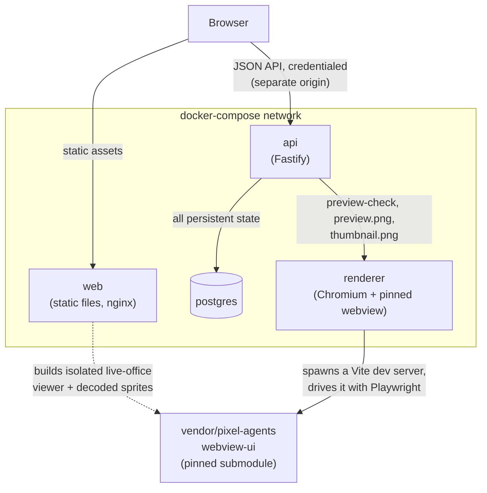

# Architecture

A quick-reference for the shape of the running system — what each of the four
deployables is, how they talk to each other, and the two design facts (a real
cross-origin split, and a browser that draws every preview) that shape almost
everything else here.

## The four services, in one line each

| Service | What it is | Owns |
|---|---|---|
| `web` | A static SPA (Vite + React), served by nginx; includes a build-time-pinned live-office viewer, which doubles as the layout editor | Nothing — no state, no secrets. Just the built frontend. |
| `api` | A Fastify service | All persistent state: layouts, users, sessions, moderation audit log. The only component with real secrets (Discord client secret, session-signing key). |
| `renderer` | A real headless Chromium driving the pinned `pixel-agents` webview | Nothing persistent. A pure function: layout JSON in, PNG out. |
| `postgres` | Postgres 17 | The single source of truth for everything `api` doesn't compute on the fly. |

`packages/layout-core` sits beside all four as a shared library, not a service — the one
definition of "what is a valid layout," consumed by `api` (submission validation),
`renderer`/CI (`npm run validate`), and nothing else, so there's no second copy of the
rules to drift out of sync.

## How they talk to each other

Two things about this diagram are load-bearing, not incidental:

**The browser talks to `web` and `api` as two separate origins.** `web` is static files
with no server-side logic — it cannot hold a secret or open a database connection. Every
dynamic thing (auth, submitting a layout, moderation) is a `fetch()` from the page's
origin to `api`'s origin, a cross-site request no matter how the two are hosted. The
session is therefore a **bearer access token held in memory by the SPA, refreshed via a
rotating bearer refresh token — never a cookie**: a cookie-based session degrades under
third-party cookie restrictions, in a deployment shape (a static frontend, a
separately-hosted API) true for every self-hoster, not just the official index. The
short-lived access token, the single-use login code delivered via a URL fragment (never
a query string, so it never lands in server logs or browser history), and the
rotate-on-every-refresh-or-revoke-the-family refresh token are the direct consequences.
See `apps/web/src/auth/AuthProvider.tsx` (the SPA's half) and `services/api/src/auth/`
(the API's half) for the implementation.

**`renderer` is reachable from `api` only — never from a browser.** It has no `ports:`
entry in `docker-compose.yml` and no CORS configured on it at all, deliberately: it is
an internal service, not a public one. Every preview a user ever sees — the pre-publish
preview-check, a layout's `preview.png`/`thumbnail.png` — is `api` proxying to
`renderer` and relaying the result, not the browser talking to `renderer` directly.

**A browser draws every preview, not a pure-code renderer.** `renderer` runs the
*actual* `vendor/pixel-agents/webview-ui` — spawned as a real Vite dev server
(`services/renderer/src/devServer.ts`), driven by Playwright with the target layout
substituted for the bundled default via the webview's own dev-mode browser mock — so a
preview can never drift from what a user's own Pixel Agents install would actually draw.
This is why `renderer` needs a full Chromium, unlike the other three services. Both
`renderer` and the `web` build consume the pinned `vendor/pixel-agents` submodule; only
the renderer boots upstream's Vite server and a headless browser at runtime.

The layout detail page also offers a **live browser rendering**. That remains entirely
static: the `web` build compiles a focused iframe entry around the pinned upstream's
`OfficeState`, `OfficeCanvas` and `ToolOverlay`, with its decoded sprites emitted under
commit-addressed asset URLs. It does not expose or call the internal renderer service,
and the iframe boundary prevents upstream's global webview styles from leaking into the
gallery. The API-supplied layout and local mock-agent state cross that boundary through
a small same-origin `postMessage` protocol.

## What each service actually needs

Every build context is the **repo root**, not the service's own directory — each
Dockerfile needs files from `packages/layout-core` and, for `api`/`renderer`,
`vendor/pixel-agents` too.

| Service | Image base | Depends on | Resource limit | Why |
|---|---|---|---|---|
| `postgres` | `postgres:17-alpine` | — | 512M | Off-the-shelf. |
| `api` | `node:22-alpine` | `postgres` (healthy) | 512M | Ordinary Node service — no browser, no heavy deps. |
| `renderer` | `mcr.microsoft.com/playwright` (pinned to the workspace's own Playwright version) | — | 2G / 2 cpu | The one service running a real browser against user-controlled input — the only limit here that isn't just tidiness. |
| `web` | `node:22-alpine` (build) → `nginx:alpine` (runtime) | pinned webview source/assets at build time | 128M | Static files behind nginx; no browser at runtime. |

`api` waits on `postgres` reporting healthy (`depends_on: condition: service_healthy`)
before it starts; nothing waits on `renderer` at boot — a preview request simply fails
until it's up.

**Configuration is environment, always.** No hostname, domain or deployment-specific
string is compiled into any image. `web`'s API base URL is build-time config
(`VITE_API_BASE_URL`); `api` takes `DATABASE_URL`, `RENDERER_URL`, `PUBLIC_WEB_ORIGIN`,
`PUBLIC_API_ORIGIN` and the Discord credentials from the environment and validates all
of them at boot — a misconfigured deployment fails once, loudly, with every missing
value listed together, not one restart per missing value. This is also why
`docker-compose.yml` itself has no reverse-proxy labels baked in: see
[`docs/deployment.md`](deployment.md) for putting a real domain and TLS in front of it,
and [its environment-variable section](deployment.md#environment-variables) for the
authoritative list of what to set and *where* — the two hosted frontends (GitHub Pages,
Vercel) are configured entirely outside this repository, and being static, neither can
hold a secret: every secret belongs to the self-hosted `api`.

## First boot: never an empty gallery

`docker-entrypoint.sh` runs database migrations, then unconditionally calls
`seedIfEmpty()` (`services/api/src/db/seed.ts`) on every boot — a no-op the instant any
layout already exists, seeded or not. The four `seed/<slug>/` layouts are git-versioned
files (`layout.json` + `meta.json` per slug), not baked into the image, so a fresh
install is never a blank page and a seed layout stays reviewable as an ordinary pull
request. Seed layouts are attributed to a synthetic system user in the database, with
the real human credit carried in `layouts.author_display`.

`meta.json` also carries an optional `visibility` (defaults to `public` when absent) and
`createdAt` (#63) — hand-curated seeds don't need either, but the same
`<slug>/{layout.json,meta.json}` shape and `LayoutMeta` type
(`packages/layout-core/src/types.ts`) is what a future admin backup/restore is expected
to reuse, so it carries the fields that round-trip needs even though nothing in this repo
writes them yet.

## See also

- [`docs/deployment.md`](deployment.md) — this doc explains *why* there are two public
  origins (`web` and `api`); that one covers putting a real domain and TLS in front of
  both (Traefik, Caddy, nginx examples).
- `services/api/README.md` — the API's own routes, config table, and auth design in
  full detail.
- `services/renderer/README.md` — the renderer's HTTP surface, caching, and concurrency
  behavior.
