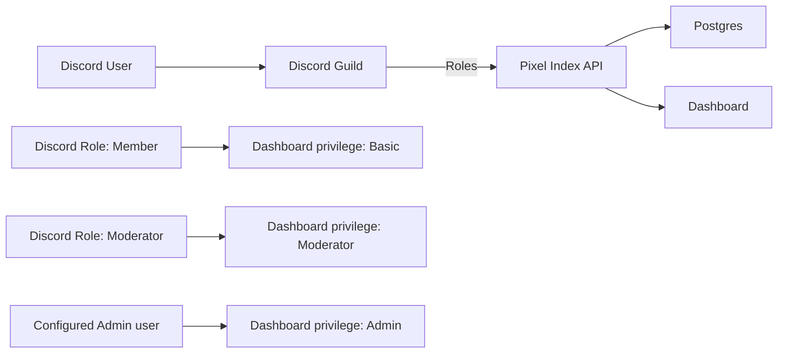

# Discord membership, capabilities, and public authors

Pixel Index talks directly to Discord's OAuth2 API. It never asks Pico and does not need
a bot token, so the index keeps working when the Discord bot is offline.



## Why the retained OAuth grant exists

Discord's `guilds.members.read` OAuth2 scope authorizes
`GET /users/@me/guilds/{guild.id}/member`. The returned guild member contains `roles`
(role IDs) and `nick`. In contrast, `guilds` and `GET /users/@me/guilds` enumerate guilds
but do not return member roles. Pixel Index therefore requests `identify
guilds.members.read`, retains the user grant, and calls the member endpoint for the one
configured guild. See Discord's [OAuth2 scopes](https://discord.com/developers/docs/topics/oauth2#shared-resources-oauth2-scopes)
and [Get Current User Guild Member](https://discord.com/developers/docs/resources/user#get-current-user-guild-member).

Access and refresh tokens are encrypted before they enter Postgres with AES-256-GCM.
`DISCORD_OAUTH_TOKEN_ENCRYPTION_KEY` is the base64 encoding of exactly 32 random bytes:

```bash
openssl rand -base64 32
```

Only deployment operators/the secret manager and the **API process** know this key. It
is needed only in the `api` Docker service. Do not expose it to the frontend, renderer,
Postgres, Pico, Discord, logs, or source control. Keep it stable and backed up: losing or
rotating it without re-encrypting rows makes retained grants unreadable and users must
reconnect Discord.

Discord observations are cached for `DISCORD_MEMBERSHIP_CACHE_TTL_MS`. The recommended
value is **60000 ms**: a demotion takes at most about one minute to remove dashboard
power, while normal navigation does not call Discord on every request. A protected API
action revalidates once the cache is stale; access JWTs contain only the Pixel Index user
ID and never contain an authorizing role claim. A revoked/unreadable OAuth grant cannot
use a previously cached privileged role.

Accounts created before this integration authorized only `identify`; those users must
complete Discord login once more to grant `guilds.members.read` and create a retained
grant. Until then the UI offers **Reconnect Discord** rather than treating missing
authorization as confirmed nonmembership.

## Configuration

| Variable | Meaning |
|---|---|
| `DISCORD_ADMIN_IDS` | Comma-separated Discord **user IDs** that receive Admin. This is usable with or without a guild. |
| `DISCORD_GUILD_ID` | Optional official community guild. Leaving it blank preserves a fully functional self-hosted index. |
| `DISCORD_MODERATOR_ROLE_IDS` | Comma-separated Discord role IDs that receive Moderator in the configured guild. |
| `DISCORD_INVITE_URL` | HTTPS invite shown to authenticated outsiders; required with a guild. |
| `DISCORD_OAUTH_TOKEN_ENCRYPTION_KEY` | API-only AES-256-GCM key; required with a guild. |
| `DISCORD_MEMBERSHIP_CACHE_TTL_MS` | Maximum age of membership/role observations; default and recommendation: `60000`. |

The official instance uses guild `1478428628709802166`, admin user IDs
`1528094749993599038,77488778255540224`, and moderator role ID
`1528065925264445622`. Supply the actual invite URL and a freshly generated encryption
key in deployment secrets.

There is no `DISCORD_SUBMISSION_ROLE_IDS`: every member of the configured guild,
including a member whose Discord `pending` flag is true, may submit. An authenticated
outsider sees `DISCORD_INVITE_URL` instead. An instance with no `DISCORD_GUILD_ID`
continues to let every authenticated user submit, so community configuration does not
break self-hosting.

## Dashboard rights

| Capability | Source | Rights |
|---|---|---|
| Basic | Member of the configured guild (or any logged-in user on an unguilded instance) | Submit/preview and manage their own layouts. |
| Moderator | Any configured moderator Discord role | Everything in Basic; list all layout visibilities, edit another author's metadata with a reason, hide, remove, and restore. |
| Admin | Discord user ID in `DISCORD_ADMIN_IDS`, after membership verification when a guild is configured | Everything in Moderator; read the user directory. |

The Admin directory contains only non-system users already present in Pixel Index — it
does not fetch or enumerate the guild. It shows the cached capability, when it was last
checked, and layout count across every visibility. Role assignment and account bans are
handled in Discord; stale Pixel Index grant/revoke/block controls and endpoints do not
exist.

## Author identity and privacy

Pixel Index still needs a `users` row to own layouts and sessions. `users.role` is only
the last verified capability cache; it is not an independent source of authority.
Profile display priority is guild nickname, then Discord global display name, then
username. These values refresh during Discord login and membership revalidation.

Public layout and author pages expose the stored display name, username, avatar, and
Pixel Index author ID. They intentionally do **not** expose Discord user IDs, guild
membership, role IDs, or capability. An author's name links to `/authors/:id`, where the
public API returns that identity and their public-layout count; the ordinary public
layout listing supplies the layouts. Non-public layouts never appear there.

The bundled seed layouts are migrated from the synthetic system user to the known
Discord author `1528094749993599038` (`pablodelucca`). Their legacy `authorDisplay` is
cleared. `authorDisplay` remains only as a compatibility fallback for other old
system-owned seed data.
