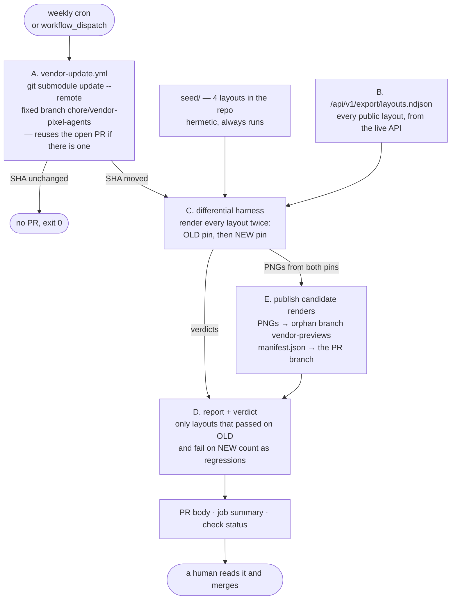
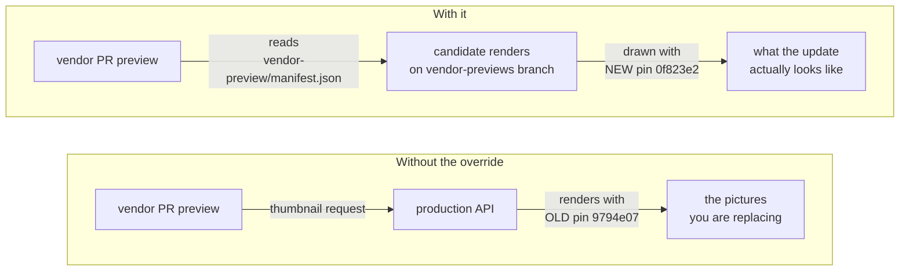
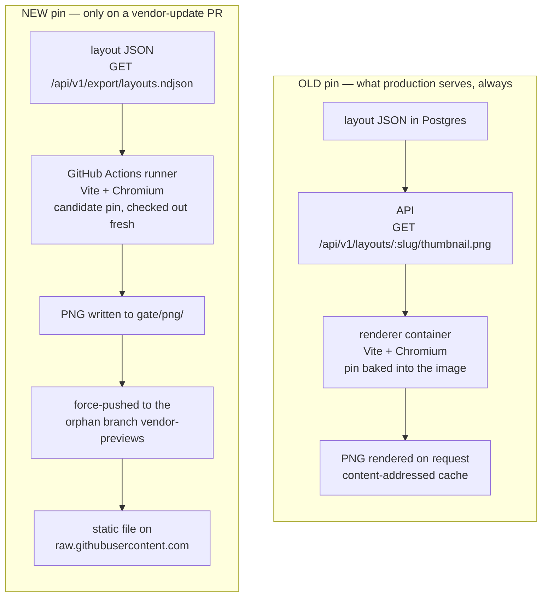
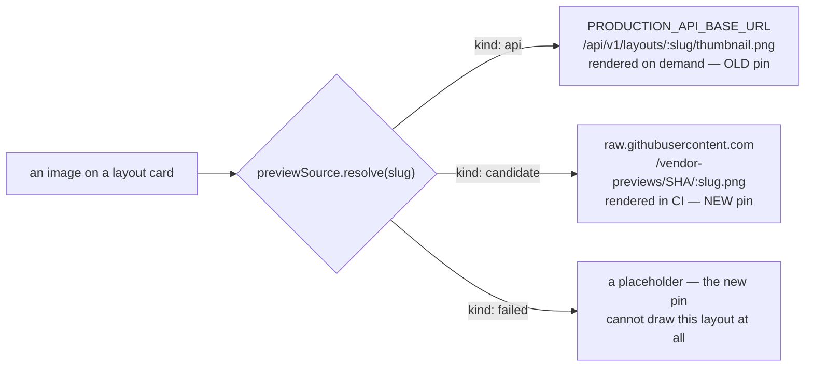
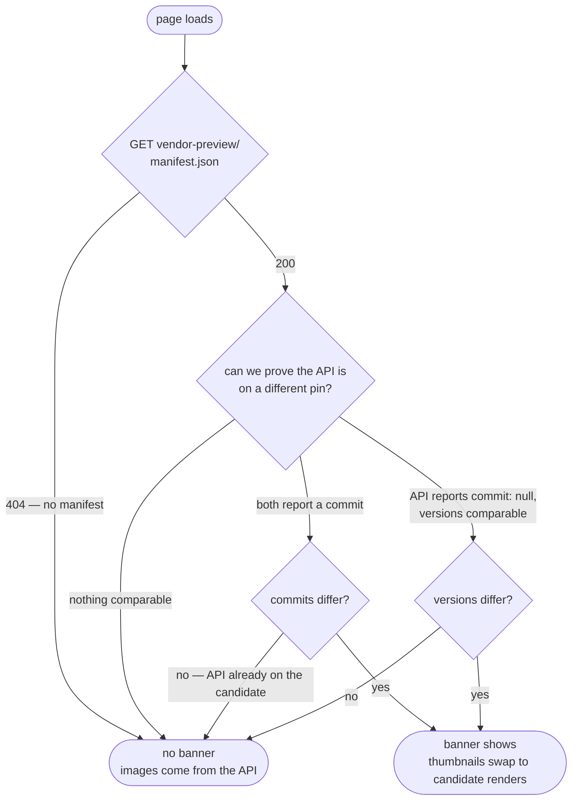
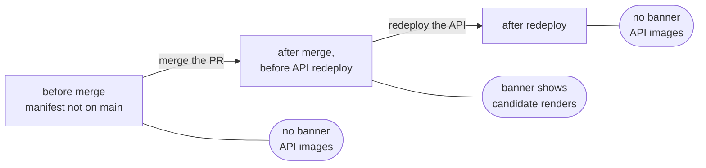

# Preview deployments

Every pull request gets a Vercel preview of `apps/web`. Almost all of them behave exactly
like production: the same static site, pointed at the same live API.

**One kind does not.** The weekly vendor-update PR shows preview images the production API
*cannot produce*, behind a banner saying so. This document explains why that exception
exists, when it applies, and what each environment actually serves — because "the preview
shows different pictures than production" is alarming if you don't know it's deliberate.

See [`deployment.md`](deployment.md) for the variables and secrets behind all of this, and
[`ARCHITECTURE.md`](ARCHITECTURE.md) for why there are two origins in the first place.

---

## The thing every preview shares

The site is static. It holds no layouts and renders no pictures; it calls
`PRODUCTION_API_BASE_URL` for both. A preview build of a branch therefore shows **your
branch's UI against production's data** — which is what makes previews useful, and what
creates the one problem below.

Preview images come from the API's renderer, and that renderer draws with **the Pixel
Agents commit pinned in the image the API was built from**. Not the pin on your branch.
That distinction is invisible and harmless for every ordinary PR, because ordinary PRs
don't change the pin.

---

## The vendor-update pipeline

`vendor-update.yml` moves `vendor/pixel-agents` and proves the move is safe.

The gate renders everything **twice** so it can answer *"did this update break it?"* rather
than *"is it broken?"* — an index of real submissions always contains a few already-broken
layouts, and reporting those would leave the check permanently red for reasons merging
cannot fix.

Step **E** is what this document is about. Those candidate PNGs already exist — the gate
had to draw them to reach a verdict — so publishing them costs nothing and solves a
problem that would otherwise make the PR unreviewable.

---

## The problem step E solves

A vendor-update PR changes which Pixel Agents draws the office. Its preview calls the
production API, which is still on the **old** pin. So without intervention:

> The one view where seeing the change matters is the one view that shows the vendor you
> are replacing.

You would be reviewing a pin bump by looking at pictures drawn by the pin it replaces.

---

## Where the pixels come from: two producers

This is the part that surprises people, so it is worth stating flatly:

- **The old pin's images are rendered by the API**, on demand, per request.
- **The new pin's images are rendered by the CI pipeline**, once, minutes earlier, and
  served as static files from a git branch.

The API never draws the new pin. It cannot — the deployed renderer only has the commit
baked into the image it was built from. That is precisely why the candidate renders have to
be produced somewhere else.

Note where the two pipelines *do* meet: the API supplies the layout JSON to both. It acts
as the **data source** for the CI render, never as its renderer. Rendering and data are
split, which is what lets the gate draw your real layouts against a pin your API has never
seen.

### The browser just picks a URL

Nothing clever happens client-side. `previewSource.resolve(slug)` returns one of three
answers and the image element points wherever it says.

### It is the same renderer, not a lookalike

`services/renderer/src/harness/run.ts` imports `startDevServer` and `Renderer` from
`services/renderer/src/` directly. There is no second implementation to drift. The gate has
to measure what production does, and the only honest way to do that is to run production's
code against a different pin.

Measured on one layout, from three independent machines:

| Producer | Pin | Bytes | SHA-256 |
|---|---|---|---|
| CI (GitHub Actions) | `0f823e2` | 15009 | `f1d320ffae60…` |
| The deployed renderer | `9794e07` | 15009 | `f1d320ffae60…` |
| A developer laptop | `9794e07` | 15009 | `f1d320ffae60…` |

Byte-identical. Two things follow. Renders are **deterministic** — the same layout and the
same pin give the same PNG anywhere — which is what makes comparing PNG hashes a usable
signal for *"this layout renders differently now"*. And this particular bump changed nothing
visually, which is why its report listed no visually-changed layouts.

Do not read that last part as the general case. When upstream changes sprites, the CI image
and the API image differ — that is the entire point, and it is what the banner is warning
you about.

### Two consequences of being static

**They are a snapshot, not live.** The candidate PNGs are frozen at the moment the workflow
ran. A layout submitted afterwards is not in the manifest and falls through to the API
(`kind: 'api'`) — unmeasured, not broken. Re-running the workflow refreshes the set.

**They do not accumulate.** `vendor-previews` is force-pushed as a single commit each run,
so the previous set becomes unreachable and is eventually collected. Images on an older
vendor PR's preview will 404 once a newer run lands. That is deliberate: a weekly job that
kept every render would grow the repository without bound.

---

## When the banner appears

The banner is:

> Previews on this deployment are rendered against **candidate Pixel Agents 0f823e2** — the
> API is still on 9794e07. Layouts the candidate cannot draw are marked rather than shown
> with their old image.

It is not dismissible and not optional. Silently swapping in different pictures would only
be lying in a new direction; the banner is what makes the swap honest.

Two conditions must both hold. The logic lives in
[`apps/web/src/api/previewSource.ts`](../apps/web/src/api/previewSource.ts).

Three properties worth knowing:

- **Commit first, version only as a fallback.** The pin routinely sits several commits past
  a tag, so two different pins often share a version — comparing on version alone would
  disarm the override on a bump that never changed the version number.
- **It fails safe.** If nothing can be compared, the override stays *off*. A live image that
  might be slightly stale beats a static one that is certainly stale.
- **It disarms itself.** The manifest is committed to the PR branch, so it *merges* along
  with the pin. Once the API is redeployed onto that same commit, the two agree and the
  override stops applying — no cleanup commit anyone has to remember.

### What a layout that fails on the candidate shows

A placeholder — *"does not render under the candidate Pixel Agents"* — never its old image.
Falling back to the API's picture for a layout the new pin cannot draw is precisely the
lie this whole mechanism exists to prevent. A layout submitted *after* the gate ran is not
in the manifest at all and simply falls through to the API: unmeasured, not broken.

---

## Environment by environment

| Environment | Built from | Manifest present? | Banner | Preview images come from |
|---|---|---|---|---|
| **Vendor-update PR preview** | `chore/vendor-pixel-agents` | **Yes** — committed by the workflow | **Yes** | The candidate renders on the `vendor-previews` branch |
| Any other PR preview | that PR's branch | No — 404 | No | The production API |
| Vercel production | `main` | No¹ | No | The production API |
| GitHub Pages | `main` | No¹ | No | The production API |
| Local `npm run dev` | your working tree | No, unless you made one | No | Whatever `VITE_API_BASE_URL` points at |

¹ Until a vendor PR merges — see the next section.

The 404 is the overwhelmingly common case, so it is cheap and completely silent: one small
failed request per page load, no `/api/v1/meta` call, nothing logged, no behaviour change.

---

## The exception: the window between merge and redeploy

**The banner is not strictly vendor-PR-only.** The manifest is committed to the PR branch,
which means merging the vendor PR puts it on `main` — and therefore into the next
production and Pages build.

For the window between **merging the PR** and **redeploying the API**, production satisfies
both conditions: the manifest is present, and the API is demonstrably still on the old pin.
So production shows the banner and the candidate renders too.

That is the mechanism working as designed rather than a bug — during that window the site's
pin genuinely has moved and the API's has not, and saying so is more honest than quietly
serving images from an upstream the repo no longer pins. But it *is* visitor-facing text on
a public gallery, so **keep the window short: redeploy the API promptly after merging a
vendor bump.** Doing so is required anyway — that is what puts the new pin into the
renderer.

---

## Reviewing a vendor-update PR

The check being green means *"nothing that rendered before fails now"*. It does **not** mean
the pixels are still right — upstream can change sprite art or z-ordering and every layout
will still validate and render while looking wrong. Only a person looking at the preview
can judge that, which is the entire reason step E exists.

So on the preview:

1. **Confirm the banner is there.** No banner on a vendor PR means the override did not
   engage and you are looking at the old pin's images — the PR body says why when that
   happens.
2. **Look at the offices, not the layout count.** Sprite changes, wall autotiling, carpet
   edges, z-order. The report already tells you which layouts render *differently* while
   still rendering — that list is the shortlist worth opening.
3. **Open anything marked as failing.** Those are named in the PR body with their issue
   code, e.g. `layout.furniture.unknown` when upstream removed a furniture id.

Then decide: merge, or moderate the affected layouts first. Merging is deliberately a human
decision — nothing here auto-merges.
