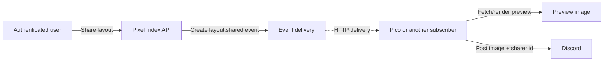

# Webhook events

Pixel Index can notify an external service when an authenticated user chooses to share
a layout. The first consumer is expected to be Pico, the Discord bot: Pixel Index sends
the event, Pico obtains a preview image, and Pico posts the image to Discord together
with the Discord user id of the person who shared it.

The event contract is defined now. The share endpoint, subscription pages and outbound
delivery are implemented separately by [issue #91](https://github.com/pixel-agents-hq/index/issues/91).
Until that issue lands, this document describes the interface those pieces must build;
it does not mean a deployed API already accepts subscriptions or emits events.

## From Share to a subscriber



Share and Publish are separate actions. A user can share a layout that has never been
submitted to the index. Consequently, every event includes the complete `layout.json`;
a slug or fetch URL could not represent the unpublished case. Inlining can make a
delivery as large as the configured layout-size limit—2 MB by default—and repeats those
bytes for every subscription, but it gives each receiver an immutable snapshot that
does not disappear if a slug is renamed or a published layout is later hidden.

The API resolves identities and publication information itself. A subscriber must not
interpret these fields as assertions supplied by an untrusted browser:

- `sharerDiscordId` identifies the authenticated actor who selected Share.
- `owner` is the layout owner's display snapshot and can describe someone other than
  the sharer. Its `discordId` is absent only for a legacy credit with no linked Discord
  account.
- `publication.published` is true only when the layout has a publicly retrievable API
  resource at the time of the event. Its absolute `url` is present exactly in that
  case. A later moderation or owner action may make that historical URL return 404.

For a layout that has no public resource, publication is represented as:

```json
{
  "published": false
}
```

There is no `url: null` or empty-string placeholder.

## Trigger limits

Share is an authenticated, per-user action. The delivery implementation in issue #91
must enforce both limits from the parent design:

- At most one accepted share in a rolling five-minute window.
- At most five accepted shares in a rolling 24-hour window.

An attempt over either limit is rejected with the API's normal `429` error response and
does not create an event to deliver later. These limits bound outbound fan-out and
preview work, protect subscribers from spam, and make a leaked user session less useful
for amplification. They limit event creation; they do not promise when an accepted
event reaches a subscriber.

## Subscriptions and secrets

A moderator or admin creates a subscription through the moderator-facing page, giving
the service a name and its HTTPS receiver URL. Pixel Index records the creating
moderator's Discord-backed identity. The Admin view lists the subscriptions and who
created each one, without revealing their secrets.

Each subscription receives an independent, cryptographically random secret. The secret
is shown once when the subscription is created and must then be stored in the receiving
service's secret manager; later Pixel Index pages show only non-secret identifying
information. A secret is associated with the creator's Discord user id, but is never
derived from that public id. The payload contains the non-secret `subscriptionId`, not
the secret or a secret prefix.

Secret creation, rotation and revocation are part of issue #91. An integrator should
not deploy a receiver until that implementation fixes the exact lifecycle and delivery
headers.

## Payload contract

The source of truth is the
[version 1 share-event JSON Schema](../services/api/schema/share-event-v1.schema.json).
Its inline `layout` field references the existing
[layout JSON Schema](../packages/layout-core/schema/layout.schema.json) rather than
copying that definition. Both schemas use JSON Schema draft 2020-12.

Every event has a reusable envelope:

- `eventId` identifies one logical share and remains stable on every retry and for
  every subscription.
- `eventType` is `layout.shared`.
- `schemaVersion` is `1`.
- `occurredAt` records when the share was accepted, not when a retry was attempted.
- `subscriptionId` identifies the destination without disclosing its secret.
- `data` contains the sharer, owner, inline layout and publication snapshot.

A receiver with more than one subscription uses `(subscriptionId, eventId)` as its
deduplication key. It must reject or safely ignore event types and schema versions it
does not implement. A breaking payload change creates a new schema version; version 1
will not be silently redefined underneath existing subscribers.

### Complete published example

The example is illustrative, while the linked schema remains authoritative. A contract
test extracts this marked block and validates it against the schema so its field names
and required values cannot drift unnoticed.

<!-- share-event-example:start -->
```json
{
  "eventId": "a75fc4d8-d0f7-4b26-9c6d-3329f9fc2834",
  "eventType": "layout.shared",
  "schemaVersion": 1,
  "occurredAt": "2026-08-15T12:34:56.000Z",
  "subscriptionId": "46fe73a0-8c49-438f-a6df-bb5d3290551a",
  "data": {
    "sharerDiscordId": "1528094749993599038",
    "owner": {
      "discordId": "77488778255540224",
      "username": "layout-owner",
      "displayName": "Layout Owner"
    },
    "layout": {
      "version": 1,
      "layoutRevision": 1,
      "cols": 2,
      "rows": 2,
      "tiles": [0, 0, 0, 0],
      "furniture": []
    },
    "publication": {
      "published": true,
      "url": "https://api.example.com/api/v1/layouts/four-rooms"
    }
  }
}
```
<!-- share-event-example:end -->

## Authenticating a delivery

The event body identifies a subscription but does not prove who sent it. The target
design for issue #91 is a versioned HMAC-SHA256 signature made with that subscription's
secret over an attempt timestamp and the exact raw HTTP body. A receiver will need to:

1. Read the request body as bytes before JSON parsing or reformatting it.
2. Reject a delivery timestamp outside the permitted replay window.
3. Recompute the HMAC and compare it with the supplied signature in constant time.
4. Only after verification, parse the JSON and validate the supported schema version.

Issue #91 must finalize the header names, signature encoding, signed byte format and
replay window. Those details are deliberately not invented here: publishing plausible
but unimplemented headers would give integrators a false contract. This document must
be updated in the delivery PR if it chooses a different authentication mechanism.

## Consuming deliveries safely

Once delivery exists, a receiver should acknowledge a verified event quickly with a
successful HTTP status and move slow work, such as rendering and posting to Discord,
off the request path. Timeouts and non-success responses may be retried, so processing
must be idempotent even after signature verification. The stable event and subscription
ids exist for that purpose.

The exact timeout, retry schedule, backoff and failure visibility belong to issue #91.
No retry count or delivery guarantee is part of the version 1 body schema.

For the Pico flow:

1. Verify the delivery and deduplicate it.
2. If `publication.published` is true, request `publication.url`; its layout response
   contains `files.preview`, the public PNG path.
3. If the layout is unpublished, post the inline `data.layout` as the JSON body of the
   existing public `POST /api/v1/layouts/preview-check` endpoint and use its PNG
   response. That render-triggering endpoint has its own IP-keyed write-rate limit.
4. Post the preview to Discord with `data.sharerDiscordId`. The receiver may also show
   the separate owner snapshot when the sharer is not the owner.

Implementing Pico's receiving side is outside this repository. After issue #91 fixes
the wire-level signature and retry behavior, its required parent-issue comment should
point the Pico implementer to this schema and document the finalized headers.
